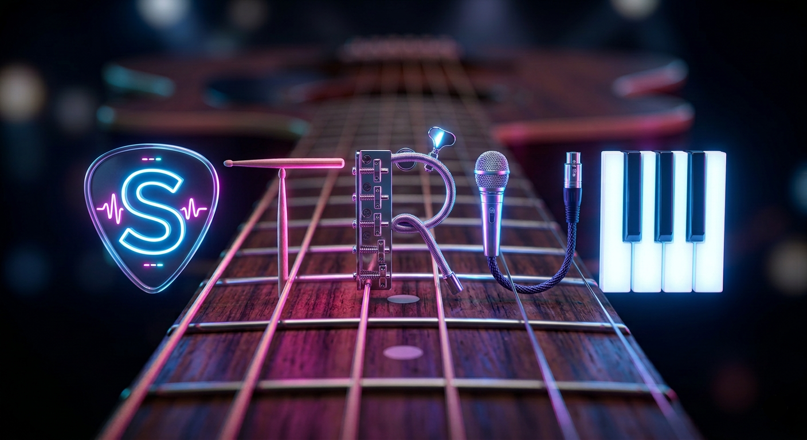

<p align="center">
  
</p>

<h1 align="center">STRUM</h1>
<h3 align="center"><b>S</b>pectral <b>T</b>ranscription & <b>R</b>hythm <b>U</b>nderstanding <b>M</b>odel</h3>

<p align="center">
  AI-powered audio-to-chart pipeline for Clone Hero & YARG
</p>

<p align="center">
  
  
  
  
</p>

---

STRUM converts any song into a fully playable Clone Hero / YARG chart package — complete with **pro drums**, **guitar**, **bass**, **vocals with lyrics**, and **keys** — all generated from audio alone.

The system uses a two-stage neural drum transcription pipeline, neural onset detection with rule-based fret mapping for guitar/bass, Whisper-powered vocal transcription with pitch tracking, and spectral analysis for keyboard detection. Charts are exported as standard MIDI with four difficulty levels (Expert, Hard, Medium, Easy) and packaged with metadata, album art, and song.ini files ready for play.

## Architecture

```
                              ┌─────────────┐
                              │  Audio File  │
                              │  (WAV/MP3)   │
                              └──────┬───────┘
                                     │
                              ┌──────▼───────┐
                              │   Demucs v4  │
                              │  Separation  │
                              └──────┬───────┘
                                     │
              ┌──────────┬───────────┼───────────┬──────────┐
              ▼          ▼           ▼           ▼          ▼
         ┌────────┐ ┌────────┐ ┌─────────┐ ┌────────┐ ┌────────┐
         │ Drums  │ │ Guitar │ │  Bass   │ │ Vocals │ │  Keys  │
         │  Stem  │ │  Stem  │ │  Stem   │ │  Stem  │ │ Other  │
         └───┬────┘ └───┬────┘ └────┬────┘ └───┬────┘ └───┬────┘
             │          │           │           │          │
             ▼          ▼           ▼           ▼          ▼
        ┌─────────┐ ┌─────────┐ ┌─────────┐ ┌─────────┐ ┌─────────┐
        │Two-Stage│ │ Neural  │ │ Neural  │ │ Whisper │ │Spectral │
        │  CRNN   │ │ Onset + │ │ Onset + │ │ + pYIN  │ │Keyboard │
        │Ensemble │ │Rule Fret│ │Rule Fret│ │ + Align │ │Detector │
        └───┬─────┘ └───┬─────┘ └───┬─────┘ └───┬─────┘ └───┬─────┘
             │          │           │           │          │
             └──────────┴───────────┼───────────┴──────────┘
                                    ▼
                          ┌──────────────────┐
                          │   Chart Export    │
                          │  .mid + song.ini │
                          │  + album art     │
                          │  (4 difficulties)│
                          └──────────────────┘
```

## Instrument Pipelines

### Drums — Two-Stage Neural Ensemble

The drums pipeline is the flagship component, using a two-stage detection-then-classification approach:

1. **Onset Detection** — V14 `TwoStageDrumsCRNN` processes mel spectrograms (128 bins, 22050 Hz) to detect drum hit positions with **93.9% F1 score**
2. **Ensemble Classification** — 6 independently trained `OnsetClassifier` models (V2, V4, V6, V12c, V15, V16) vote on each detected onset to classify across 8 lanes (Kick, Snare, Hi-Hat, Crash, Ride, High Tom, Mid Tom, Floor Tom) achieving **85.2% F1 score**
3. **Spectral Disambiguation** — Spectral centroid analysis resolves tom/cymbal confusion in ambiguous frequency ranges
4. **Post-Processing** — Bidirectional iterative streak smoothing, kick-suppresses-floor-tom logic, rhythmic quantization, and lane conflict resolution

Pro drums are fully supported with separate tom and cymbal markers per the Clone Hero MIDI specification.

### Guitar & Bass — Neural Onset + Rule-Based Fret Mapping

Guitar and bass share the same hybrid architecture:

1. **Onset Detection** — `OnsetCRNN` neural network detects note onsets from separated stem audio
2. **Pitch Estimation** — `librosa.pyin` extracts fundamental frequencies with harmonic analysis
3. **Fret Mapping** — Rule-based system assigns MIDI pitches to 5 Clone Hero frets using register-based allocation with configurable open-note thresholds

### Vocals — Whisper + pYIN Pitch Tracking

1. **Lyric Transcription** — OpenAI Whisper extracts word-level timestamps from the vocal stem
2. **Pitch Detection** — `librosa.pyin` tracks vocal pitch contours at high time resolution
3. **Dynamic Alignment** — Whisper word boundaries are aligned with pitch onsets for accurate note placement
4. **Lyrics Fetching** — Optional synced lyrics from LRCLIB and Lyrics.ovh APIs
5. **Harmony Detection** — Configurable threshold (default 30%) for harmony/backing vocal phrases

### Keys — Spectral Keyboard Detection

1. **Keyboard Detection** — Spectral flatness and harmonic ratio analysis identifies keyboard-active regions in the "other" stem
2. **Note Extraction** — `librosa.onset_detect` + `librosa.piptrack` extract individual key hits
3. **Dual Output** — Both 5-lane simplified and Pro Keys (full piano range) tracks

## Tempo Detection

STRUM uses a grid-alignment BPM refinement algorithm that searches ±5 BPM around an initial `librosa` estimate at 0.1 BPM resolution. Phase coherence is measured using circular statistics on beat positions relative to onset times, selecting the BPM with maximum alignment. This reduces grid error from ~175ms to ~35ms on typical tracks. Tempo changes are detected when BPM shifts exceed 3 BPM with at least 8 beat persistence.

## Performance

| Component | Metric | Score |
|-----------|--------|-------|
| Onset Detection (V14) | F1 Score | 93.9% |
| Drum Classification (6-model ensemble) | F1 Score | 85.2% |
| Best Single Classifier (V12c) | F1 Score | 83.8% |

Evaluated on a held-out test set from ~5,000 human-authored Clone Hero/YARG pro drum charts.

## Quick Start

### Prerequisites

- Python 3.11+
- PyTorch 2.x with CUDA
- ffmpeg
- ~6 GB disk for model checkpoints

### Installation

```bash
git clone https://github.com/yourusername/strum.git
cd strum
pip install -e .
```

### Generate Charts for a Song

```bash
# Full chart package (all instruments)
python scripts/batch_pipeline.py \
  --songs-dir /path/to/songs/ \
  --output-dir /path/to/output/ \
  --instruments drums guitar bass vocals keys

# Drums only (production pipeline)
python scripts/batch_infer_hybrid.py \
  --songs-dir /path/to/songs/ \
  --output-dir /path/to/output/
```

### CLI Interface

```bash
# Preprocess dataset (stem separation + chart parsing)
strum preprocess --input-dir ./raw/ --output-dir ./processed/

# Train drum model
strum train drums --config configs/drums_v14.yaml

# Single-song inference
strum infer drums --input song.wav --output song_drums.mid

# Full chart generation
strum chart --input song.wav --output-dir ./charts/

# Batch processing
strum batch --manifest manifest.json --workers 4

# Evaluate on test set
strum evaluate --manifest test_manifest.json --instrument drums
```

### Training Your Own Models

```bash
# 1. Preprocess dataset (requires songs with existing .mid/.chart files)
python scripts/preprocess_onset_windows.py \
  --manifest /path/to/manifest.json \
  --output-dir /path/to/processed/

# 2. Train onset detector
python scripts/train_onset_classifier.py \
  --config configs/onset_classifier.yaml

# 3. Train guitar onset model
python scripts/train_guitar_onset.py \
  --config configs/drums_v14.yaml
```

## Project Structure

```
strum/
├── configs/                          # Hydra configuration files
│   ├── drums_v14.yaml                # Two-stage drums config
│   ├── onset_classifier*.yaml        # Ensemble classifier configs
│   ├── inference.yaml                # Inference settings
│   └── preprocessing.yaml            # Preprocessing settings
├── checkpoints/                      # Trained model weights
│   ├── drums_v14/                    # Two-stage onset detector
│   └── onset_classifier_v*/          # Ensemble classifier models
├── scripts/
│   ├── batch_pipeline.py             # Full multi-instrument pipeline
│   ├── batch_infer_hybrid.py         # Production drums pipeline
│   ├── guitar_hybrid.py              # Guitar/bass transcription
│   ├── vocals_charter.py             # Vocal transcription + lyrics
│   ├── keys_charter.py               # Keyboard detection + charting
│   ├── chart_postprocess.py          # Post-processing & quantization
│   ├── train_onset_classifier.py     # Classifier training loop
│   ├── train_guitar_onset.py         # Guitar onset training
│   └── preprocess_onset_windows.py   # Dataset preprocessing
├── src/
│   ├── cli.py                        # Click CLI entry point
│   ├── models/
│   │   ├── drums_v13.py              # TwoStageDrumsCRNN architecture
│   │   ├── onset_classifier.py       # OnsetClassifier architecture
│   │   └── common.py                 # Shared layers
│   ├── preprocessing/
│   │   ├── parsers/                  # .mid and .chart parsers
│   │   ├── alignment.py              # Audio-chart alignment
│   │   └── separation.py             # Demucs wrapper
│   ├── inference/
│   │   └── unified.py                # Unified inference engine
│   ├── export/
│   │   ├── midi.py                   # Pro drums MIDI export
│   │   └── chart.py                  # .chart format export
│   ├── evaluation/
│   │   ├── metrics.py                # F1, precision, recall
│   │   └── evaluate_drums.py         # Drums evaluation pipeline
│   └── lyrics/
│       └── fetcher.py                # LRCLIB + Lyrics.ovh fetcher
├── docs/
│   ├── ARCHITECTURE.md               # Technical specification
│   └── ROADMAP.md                    # Development milestones
└── pyproject.toml                    # Dependencies & project config
```

## Tech Stack

| Component | Technology |
|-----------|-----------|
| Language | Python 3.11+ |
| ML Framework | PyTorch 2.x |
| Audio Separation | Demucs v4 (HTDemucs) |
| Pitch Detection | librosa pYIN |
| Speech-to-Text | OpenAI Whisper |
| MIDI I/O | mido |
| Experiment Tracking | Weights & Biases |
| Config Management | Hydra |
| Audio Processing | librosa, soundfile |
| CLI | Click + Rich |

## Chart Output Format

STRUM generates standard Clone Hero / YARG compatible chart packages:

```
Song Name/
├── notes.mid          # MIDI chart (480 ticks/beat, 4 difficulty levels)
├── song.ini           # Metadata (artist, title, charter, BPM)
├── song.ogg           # Audio file
└── album.png          # Album art (fetched automatically)
```

Each MIDI contains up to 5 instrument tracks:
- **PART DRUMS** — 5-lane pro drums with cymbal markers (MIDI notes 96-100, tom markers 110-112)
- **PART GUITAR** — 5-fret guitar (MIDI notes 96-100)
- **PART BASS** — 5-fret bass (MIDI notes 96-100)
- **PART VOCALS** — Pitched vocal phrases with lyric events
- **PART KEYS** — 5-lane keys + optional Pro Keys

Four difficulty levels per instrument: Expert, Hard, Medium, Easy (progressive note reduction).

## Development

Developed on NVIDIA DGX Spark (GB10 GPU, CUDA 12.8). Trained on ~5,000 human-authored pro drum charts from the Clone Hero community.

## Documentation

- [Architecture](docs/ARCHITECTURE.md) — Technical specification
- [Roadmap](docs/ROADMAP.md) — Development milestones

## Acknowledgments

- [Demucs](https://github.com/adefossez/demucs) — Audio source separation
- [OpenAI Whisper](https://github.com/openai/whisper) — Speech recognition
- [librosa](https://librosa.org/) — Audio analysis
- Clone Hero / YARG communities — Chart format documentation

## License

MIT
